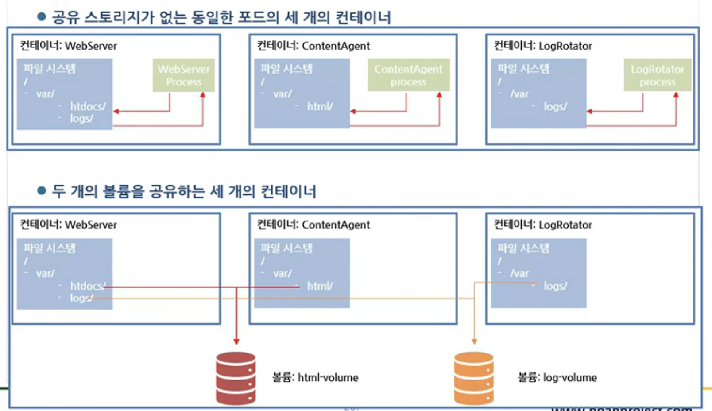
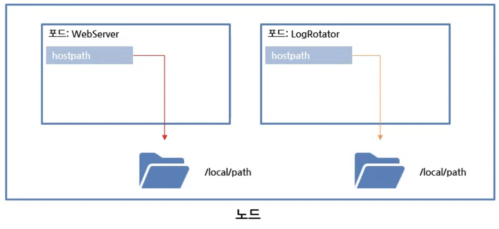
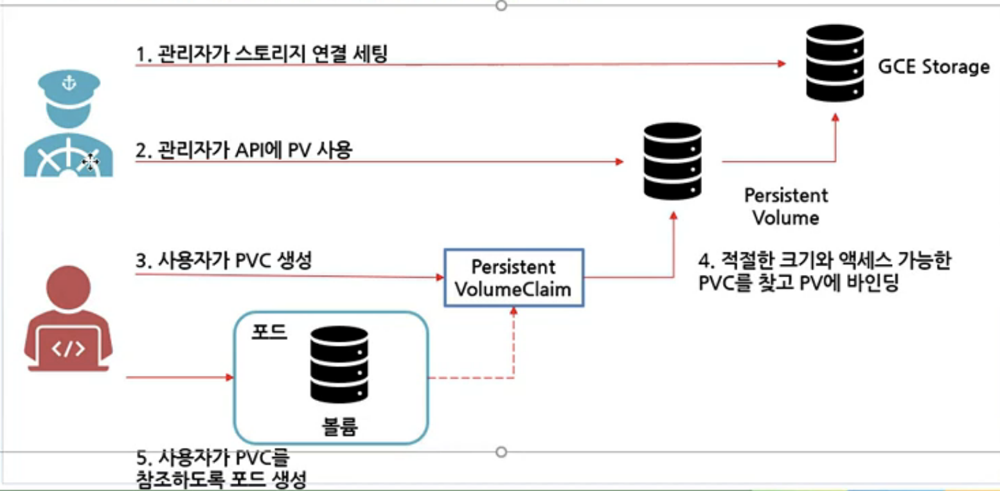
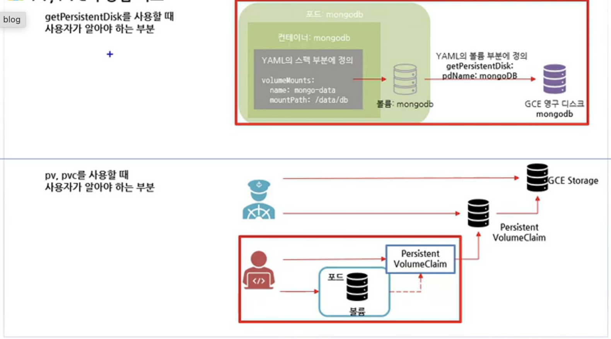

# Storage

## Volume

- 컨테이너가 외부 스토리지에 액세스하고 공유하는 방법
- 파드의 각 컨테이너에는 고유의 분리된 파일 시스템 존재
- 볼륨은 파드의 컴포넌트이며 파드의 스펙에 의해 정의
- 독립적인 쿠버네티스 오브젝트가 아니며 스스로 생성, 삭제 불가
- 각 컨테이너의 파일 시스템의 볼륨을 마운트하여 생성

### Volume의 종류

- 임시볼륨: emptyDir
  - 컨테이너 간 FileSystem 공유
- 로컬볼륨: hostpath, local
  - 노드 간 File System 공유, 노드 관리 목적
- 네트워크 볼륨: iSCSI, NFS, cephFS, glusterFS, ...
- 클라우드 종속적 네트워크 볼륨: gcePersistentDisk. awsEBS, azure File, ...

### 주요 사용 가능한 볼륨의 유형

- emptyDir: 일시적인 데이터 저장, 비어있는 디렉터리,
- hostPath: 파드에 호스트 노드의 파일 시스템에서 파일이나 디렉토리를 마운트

## emptyDir

### emptyDir을 활용한 파일 시스템 공유



### emptyDir 볼륨 사용하기

- `Dockerfile`

```docker
FROM busybox:latest
ADD count.sh /bin/count.sh
ENTRYPOINT /bin/count.sh
```

- `count.sh`

```bash
#!/bin/bash
trap "exit" SIGINT
mkdir /var/htdocs

SET=$(seq 0 99999)

for i in $SET; do
  echo "Running loop seq "$i > /var/htdocs/index.html
  sleep 10
done
```

- then, run:

```bash
docker build -t sample/count
docker push sample/count
```

- `count-httpd.yaml`

```yaml
apiVersion: v1
kind: Pod
metadata:
  name: count
spec:
  containers:
    - image: sample/count
      name: html-generator
      volumeMounts:
        - name: html
          mountPath: /var/htdocs
    - image: httpd
      name: web-server
      volumeMounts:
        - name: html
          mountPath: /usr/local/apache2/htdocs
          readOnly: true
      ports:
        - containerPort: 80
          protocol: TCP
  volumes:
    - name: html
      emptyDir: {}
```

- then, apply the yaml:

```bash
$ kubectl create -f count-pod.yaml
pod/count created

$ kubectl port-forward count 8080:80 &
Forwarding from 127.0.0.1:8080 -> 80

$ curl 127.0.0.1:8080
Handling connection for 8080
You will engage in a profitable business activity.
```

## hostpath

- 노드의 파일 시스템에 있는 특정 파일 또는 디렉터리 지정
- 영구 스토리지
- 다른 노드의 파드끼리 데이터 공유는 안됨

### hostpath을 활용한 파일 시스템 공유



### hostpath 사용 현황 파악하기

```bash
$ kubectl get pods --namespace kube-system
NAME                                      READY   STATUS    RESTARTS  AGE
event-exporter-v0.2.4-fheqfuiqwhd-23ews   2/2     Running   0         1h
fluentd-scaler-dh9d1d2-43diw              1/1     Running   0         1h
fluentd-v3.2.0-3edis                      2/2     Running   0         1h
fluentd-v3.2.0-fiw9w                      2/2     Running   0         1h

$ kubectl describe pod fluentd-v3.2.0-3edis --namespace kube-system
Name:             fluentd-v3.2.0-3edis
Namespace:        kube-system
...
Volumes:
  varlog:
    Type:         HostPath
    Path:         /var/log
    HostPathType:
  varlibdockerconatiners:
    Type:         HostPath (bare host directory volume)
    Path:         /var/lib/docker/containers
    HostPathType:
    ...
```

### hostpath 컨테이너와 노드 간 데이터 공유 실습

- `hostpath-httpd.yaml`

````yaml
```yaml
apiVersion: v1
kind: Pod
metadata:
  name: hostpath-http
spec:
  containers:
    - image: sample/count
      name: html-generator
      volumeMounts:
        - name: html
          mountPath: /var/htdocs
    - image: httpd
      name: web-server
      volumeMounts:
        - name: html
          mountPath: /usr/local/apache2/htdocs
          readOnly: true
      ports:
        - containerPort: 80
          protocol: TCP
  volumes:
    - name: html
      hostPath:
        path: /var/htdocs
        type: Directory
````

```bash
$ sudo mkdir /var/htdocs
$ sudo echo "work1" > /var/htdocs/index.html
$ kubectl create -f hostpath-httpd.yaml
pod/hostpath-http created
$ kubectl port-forward hostpath-http 8888:80
```

## NFS

## NFS 네트워크 볼륨 사용하기

- 서버 설치 방법

```bash
apt-get update
apt-get install nfs-common nfs-kernel-server portmap
```

- 공유할 디렉토리 생성

```bash
mkdir /home/nfs
chmod 777 /home/nfs
```

- /etc/exports 파일에 다음 내용 추가

```bash
/home/nfs 0.0.0.0 (rw,all_squash,async)
mount -t nfs <nfs 서버 IP>:/home/nfs /mnt
```

## PV/PVC

### 파드 개발자 입장에서의 추상화

- 파드 개발자가 클러스터에서 스토리지를 사용할 때 인프라를 알아야 할까?
- 실제 네트워크 스토리지를 사용하려면 알아야 함
- 어플리케이션을 배포하는 개발자가 스토리지 기술의 종류를 몰라도 상관없도록 하는 것이 이상적
- 인프라 관련 처리는 클러스터 관리자의 유일한 도메인
- pv와 pvc를 사용해 관리자와 사용자의 영역을 나눔

### PersistentVolume(PV)과 PersistentVolumeClaim(PVC)

- 인프라 세부 사항을 알지 못해도 클러스터의 스토리지를 사용할 수 있도록 제공해주는 리소스
- 파드 안에 영구 볼륨을 사용하도록 하는 방법은 다소 복잡



### 장점 비교

- getPersistentDisk를 사용할 때 사용자가 알아야하는 부분과 pc, pvc를 사용할 때 사용자가 알아야 하는 부분은 상이



### PV, PVC 정의

- PVC는 네임스페이스에 속하지 않는다.
- `mongo-pvc.yaml`

```yaml
apiVersion: v1
kind: PersistentVolumeClain
metadata:
  name: mongodb-pvc
spec:
  resources:
    requests:
      stroage: 1Gi
  accessModes:
    - ReadWriteOnce
  storageClassName: ""
```

- `mongo-pv.yaml`

```yaml
apiVersion: v1
kind: PersisVolume
metadata:
  name: mongodb-pv
spec:
  capacity:
    storage: 1Gi
  accessModes:
    - ReadWriteOnce
    - ReadOnlyMany
  persistentVolumeReclaimPolicy: Retain
  gcePersistentDisk:
    pdName: mongodb
    fsType: ext4
```
