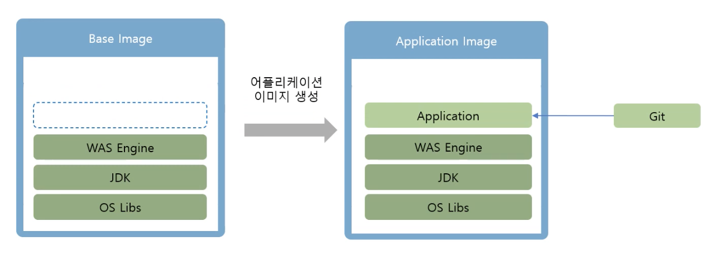
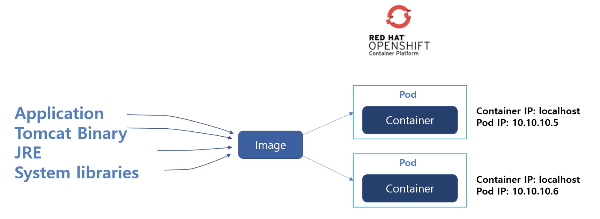
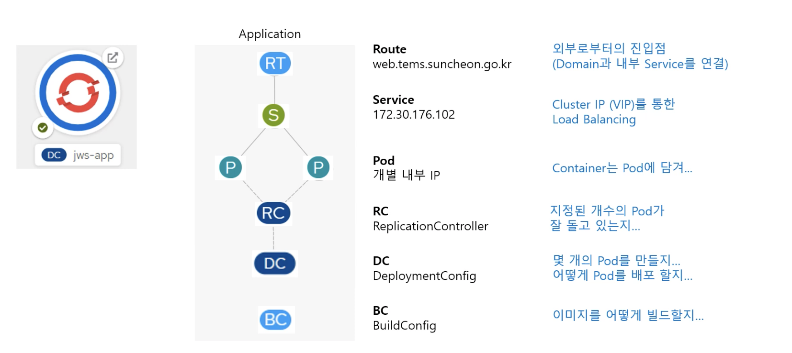
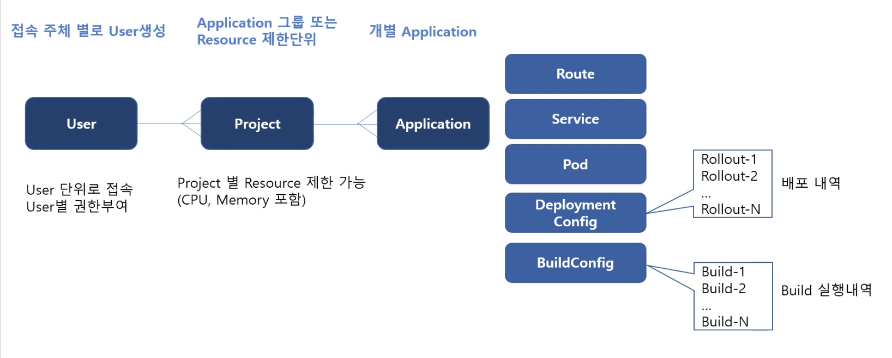

# OpenShift

- Written in Nov. 26. 2021
- Authored by Jaycol Kim <jaycol@gmail.com>

## CRI-O

- Open Container Initiative는 컨테이너 기술을 표준화하고 그 결과로 표준 Runtime인 cri-o를 제작
- Openshift 4 부터는 cri-o를 사용하고 있음

## OpenShift 기본 활용

- PaaS 솔루션
- 컨테이너를 이용하여 플랫폼 제공
- Git에 저장된 어플리케이션으로 최종 이미지 구성

### Redhat Openshift Container Platform(OCP)에서 이미지를 만드는 방식

- 기본 Base 이미지에 Application을 추가하여 실제 작동 가능한 이미지를 생성

### 어플리케이션 구성 아키텍처

- Pod: 컨테이너를 포함하는 구조, IP 주소 할당되는 지점
  - Pod는 확장 가능하므로 IP가 동일하게 유지되지는 않으며, Pod 생성 지점에서 변경됨

## S2I

- S2I (Source-to-Image)는 소스 코드로부터 컨테이너 이미지를 빌드하기 위한 툴킷과 워크플로우입니다. S2I는 `소스 코드`를 `컨테이너 이미지`에 삽입하고 컨테이너가 해당 소스 코드를 실행할 수 있도록 컨테이너를 준비시켜 즉시 실행 가능한 이미지를 생성합니다.
- 즉, 소스 코드를 git과 같은 리포지토리에 push하여 업데이트하게 되면 일련의 과정을 거쳐 Openshift 상에 실행중인 앱에 변경사항이 자동으로 업데이트 됩니다.

### Process

1. 빌더 이미지 내 S2I 스크립트 다운로드
1. 어플리케이션 소스 다운로드
1. 스크립트 및 빌더 이미지 컨테이너로 어플리케이션 소스 스트리밍
1. 빌더 이미지에 정의된 `assemble` 스크립트 실행
1. 최종 이미지 저장

### S2I Build

## S2I 빌더 이미지 만들기

[Source-To-Image](https://github.com/openshift/source-to-image/blob/master/docs/builder_image.md#required-image-contents) (S2I)는 빌더 이미지를 만드는데 매우 유용한 독립적인 툴입니다. OpenShift4의 앱을 빌드할 때에도 주로 쓰이는데, 다음의 이유 때문에 많이 쓰입니다:

- 속도: 각각 별개 스텝의 레이어를 거치지 않고도 수많은 복잡한 연산을 수행할 수 있습니다.
- 패치 유용성: 보안 이슈 등으로 인한 이미지 패치에 있어 연속적인 리빌드를 제공합니다.
- 유저 효율성: 느리고 반복적인 작업을 요하는 임의의 yum install 과 같은 타입의 명령을 하지 않게 해줍니다.
- 에코시스템: 같은 생태계의 에코시스템을 지원하여 당신의 앱의 최적화된 이미지를 제공할 수 있도록 노력합니다.

## FCOS 배포 방법 선택

OKD 용 FCOS 설치 방법 간의 차이점은 다음 두 가지로 나뉜다:

  1. 설치 프로그램이 프로비저닝한 인프라에 배포하는지
    - 각 node에 콘텐츠를 배치하는 ignition 구성을 제공하여 클러스터를 처음 부팅할 때
  1. 사용자가 배포하는지

## References

- [1 OpenShift 4 소개 - PaaS 플랫폼](https://www.youtube.com/watch?v=ft9b4bTRtoI&ab_channel=%EC%96%91%ED%9D%AC%EC%84%A0)
